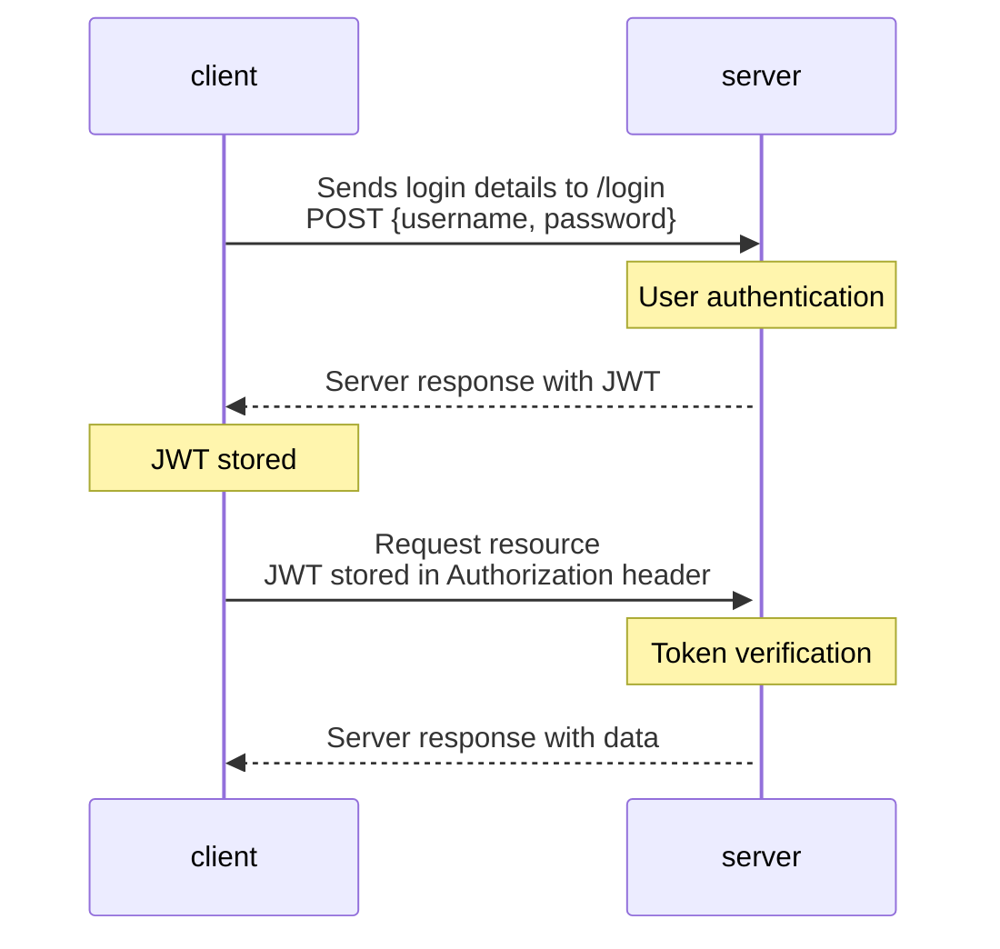

## Album collection back-end
Spring Boot back-end application communicating with MariaDB database, handling JWT authentication and exposing REST APIs for Album collection React application.  

[Front-end GitHub respository](https://github.com/niklasovaska/course-project-album-app-front) 

### Album, artist and appUser entities
Album.java
```java
@Entity
public class Album {
    @Id
    @GeneratedValue(strategy = GenerationType.AUTO)
    private Long id;

    @NotBlank(message = "Album title is mandatory")
    private String title;

    @NotNull
    @Min(value=1, message = "Please enter a valid year")
    private int releaseYear;

    @DecimalMin(value="0.0", message = "Rating should not be less than 0")
    @DecimalMax(value="5.0", message = "Rating should not be greater than 5")
    private double rating;

    @ManyToOne
    @JoinColumn(name = "artistId")
    private Artist artist;

    //Getters and setters
}
```
Artist.java
```java
@Entity
public class Artist {
    @Id
    @GeneratedValue(strategy = GenerationType.AUTO)
    private Long artistId;
    private String name;

    @JsonIgnore
    @OneToMany(cascade = CascadeType.ALL, mappedBy = "artist")

    //Getters and setters
}
```
appUser.java
```java
@Entity
public class AppUser {
    @Id
    @GeneratedValue(strategy = GenerationType.AUTO)
    @Column(name = "id", nullable = false, updatable = false)
    private Long id;

    @Column(name = "username", nullable = false, unique = true)
    private String username;

    @Column(name = "password", nullable = false)
    private String password;

    @Column(name = "role", nullable = false)
    private String role;

    //Getters and setters
}
```

### JWT authentication diagram
