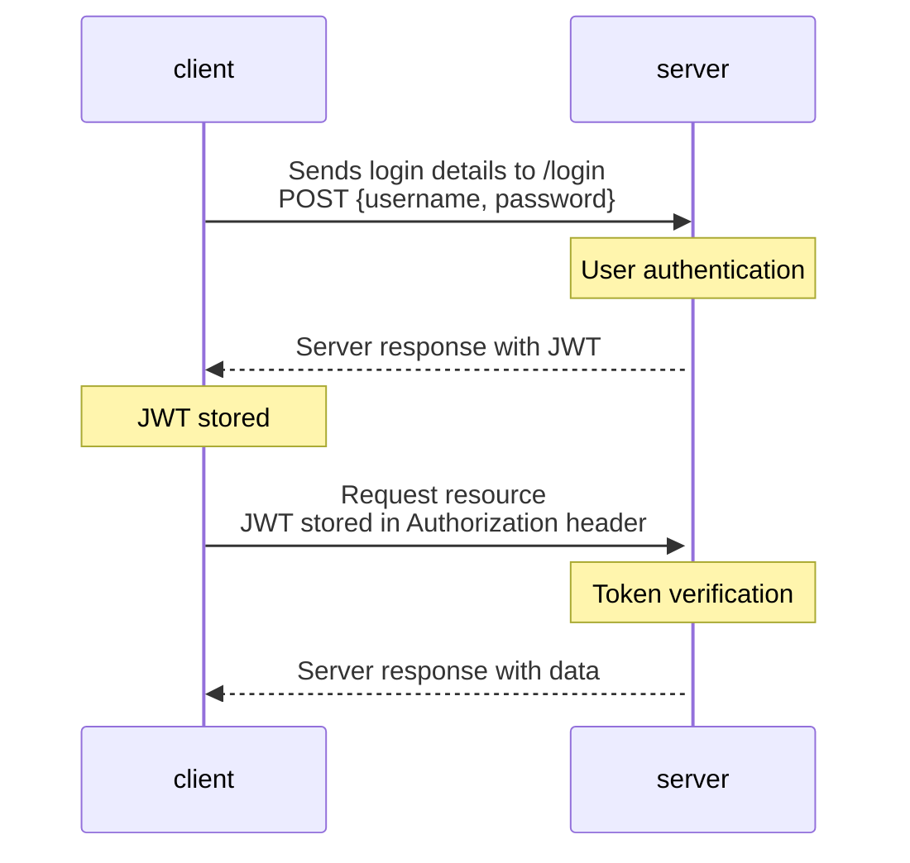

## Album collection back-end
Spring Boot back-end application communicating with MariaDB database, handling JWT authentication and exposing REST APIs for Album collection React application.  

[Front-end GitHub respository](https://github.com/niklasovaska/course-project-album-app-front) 
### JWT authentication diagram
